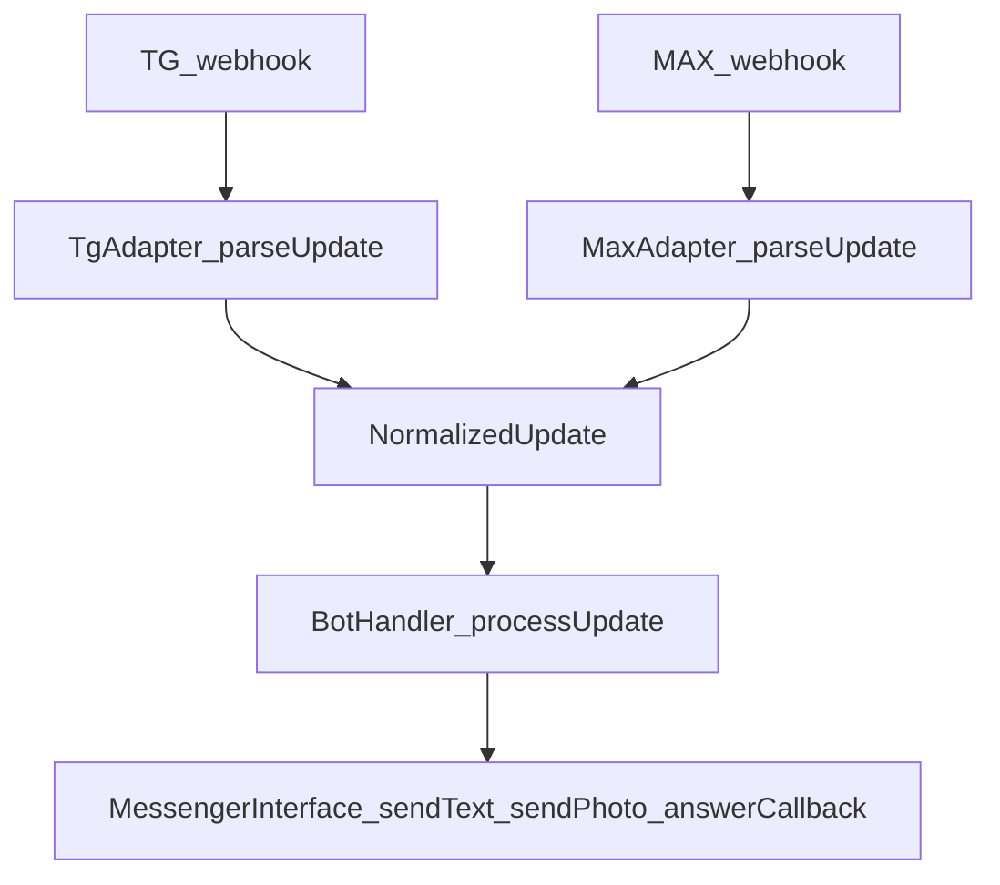

## TL;DR

**Цель**: писать бизнес‑логику 1 раз и запускать её в **двух мессенджерах**:
- Telegram (Bot API)
- MAX (`platform-api.max.ru`, совместим по модели с TamTam Bot API)

Ключевая идея: `Adapter(TG/MAX) -> NormalizedUpdate -> BotHandler(общий)` + общий интерфейс отправки сообщений.

Референс‑реализация: `cvetbuket.com`:
- `bot/MessengerInterface.php` — контракт транспорта
- `bot/TelegramAdapter.php`, `bot/MaxAdapter.php` — адаптеры
- `bot/NormalizedUpdate.php` — нормализованный апдейт
- `bot/BotHandler.php` — единая бизнес‑логика
- `webhook.php` и `max_webhook.php` — разные входы, одинаковая обработка

---

## Архитектура (паттерн)

### Контракты

#### 1) MessengerInterface (транспорт)

Минимальный набор возможностей (как в `cvetbuket.com/bot/MessengerInterface.php`):
- `sendText(chat_id, text, keyboard?)`
- `sendPhoto(chat_id, url_or_file, caption?, keyboard?)`
- `answerCallback(callback_id, text?)`
- `parseUpdate(raw) -> NormalizedUpdate | None`
- `getName() -> 'telegram' | 'max' | ...`
- фичи‑флаги: `supportsContactRequest()`, `supportsWebApp()` (важно для деградации UX)

#### 2) NormalizedUpdate (унифицированный вход)

Нужно договориться о полях, которые **гарантирует** адаптер:
- `type`: `message` | `callback`
- `chatId`: строка
- `text`: строка (для callback обычно пустая)
- `callbackData`, `callbackId` (для callback)
- дополнительные поля по необходимости: `fromUsername`, `contact`, `webAppData`, `photoFileId` (TG), `photoUrl` (MAX), `location`.

#### 3) BotHandler (общая логика)

Обработчик **не должен знать** про TG/MAX, кроме:
- «фичи» через `supports*()` (например WebApp только в TG)
- редких маппингов в интеграции с БД/настройками.

---

## Как применить в `staffprobot`

Откройте `GUIDE_STAFFPROBOT_MAX_BOT.md` рядом — там пошаговая инструкция под текущий стек `python-telegram-bot`.

