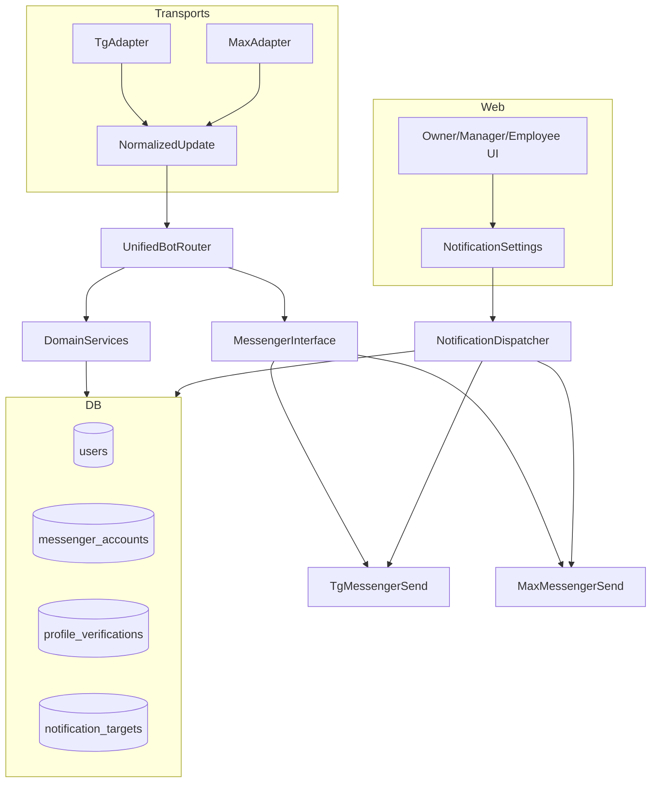

## Контекст и цель

Нужно внедрить **MAX‑бота** в StaffProBot так, чтобы:

- **логика была одна** (команды, сценарии, FSM), а различия жили в адаптерах;
- пользователь мог быть авторизован/привязан **одновременно** в Telegram и MAX (один `user_id` в БД);
- веб‑часть (авторизация, карточки сотрудников, договоры, настройки) корректно работала без жёсткой привязки к TG;
- появился новый канал оповещений **MAX** (везде, где сейчас Telegram), с настройками у собственника/организации/объекта.

Источник паттерна: `.cursor/skills/tg-max-bots/GUIDE_STAFFPROBOT_MAX_BOT.md`.

## Обязательные инварианты (важно не сломать)

- `user_id` — внутренний ID из БД, а не `telegram_id` (см. правила проекта).
- Маршрутизация по ролям не меняется (префиксы только в `apps/web/app.py`).
- Уведомления с deep‑link в веб остаются (авто‑логин токены, URLHelper и т.п.).

## Общая архитектура (целевое состояние)

- **UnifiedBotRouter**: единый обработчик команд/сценариев.
- **TgAdapter / MaxAdapter**: преобразуют вход в `NormalizedUpdate`.
- **MessengerInterface**: единый выход (send_text/send_media/answer_callback + feature flags).
- **DB** хранит *несколько* привязок мессенджеров к одному пользователю и *несколько* целевых чатов/каналов для уведомлений.

---

## Фаза 0 — Инвентаризация (завершена)

> **Phase 0 завершена.** Таблица ниже — выход Phase 0 → **бэклог Phase 1**.

### Таблица изменений по файлам/модулям (Phase 0 output → Phase 1 backlog)

| Зона                           | Файл(ы)                                                                                                                                            | Что сейчас                                                                                  | Проблема для MAX                                                                     | Что меняем в Phase 1+                                                                            | Риск/заметки                        |
| ------------------------------ | -------------------------------------------------------------------------------------------------------------------------------------------------- | ------------------------------------------------------------------------------------------- | ------------------------------------------------------------------------------------ | ------------------------------------------------------------------------------------------------ | ----------------------------------- |
| **Users (DB)**                 | `domain/entities/user.py`                                                                                                                          | `users.telegram_id` = `unique`, `nullable=False` (TG обязателен)                            | нельзя user без TG, нельзя 2 мессенджера на 1 user                                   | вынести привязки в `messenger_accounts`; `users.telegram_id` → legacy/optional                   | миграция данных + уникальность      |
| **Web login**                  | `apps/web/routes/auth.py`                                                                                                                          | логин по `telegram_id + PIN`                                                                | MAX user не может войти/привязаться; логика везде думает TG                          | сделать linking по `user_id` + messenger; добавить MAX linking flow; убрать TG как "primary key" | затронет фронт/формы/токены         |
| **Auto-login**                 | `apps/web/routes/auth.py`, `core/auth/auto_login.py`, `shared/services/notification_dispatcher.py`                                                 | auto-login токены валидируются в `telegram_id`; deep-link строится через `user.telegram_id` | MAX-уведомления не смогут давать авто-логин без TG                                   | перевести auto-login на `user_id` (one-time token → user_id)                                     | критично для всех уведомлений       |
| **JWT payload**                | `apps/web/routes/auth.py`, middleware current_user                                                                                                 | в payload есть `id` и `telegram_id`; местами путают `id` и telegram_id                      | при добавлении MAX путаница усилится                                                 | закрепить: `id` = internal user_id; messenger IDs жить отдельно                                  | уже найдено место с багом           |
| **Notifications dispatcher**   | `shared/services/notification_dispatcher.py`                                                                                                       | канал TELEGRAM шлёт на `user.telegram_id`                                                   | для MAX нужен другой target; нужен resolver target per channel                       | добавить MAX канал + resolver (user messenger_account / notification_targets)                    | менять минимум, без регрессий       |
| **Telegram sender**            | `shared/services/senders/telegram_sender.py`                                                                                                       | `send_notification(... telegram_id)` и `chat_id=telegram_id`                                | не годится как универсальный sender                                                  | оставить как TG sender; добавить MAX sender                                                      | норм                                |
| **Notification templates**     | `shared/templates/notifications/base_templates.py`                                                                                                 | ориентировано на Telegram deep-link                                                         | MAX должен тоже иметь link/button                                                    | расширить шаблоны на MAX (кнопка-ссылка или текст)                                               | зависит от возможностей MAX UI      |
| **Object report group (DB)**   | `domain/entities/object.py`                                                                                                                        | `telegram_report_chat_id`, `inherit_telegram_chat`                                          | нужен max_report_chat_id или универсальные targets                                   | ввести `notification_targets` (scope=object) и мигрировать TG поле                               | влияет на bot media reports         |
| **Org unit report group (DB)** | `domain/entities/org_structure.py`                                                                                                                 | `telegram_report_chat_id`                                                                   | нужен аналог для MAX                                                                 | перенос в `notification_targets` (scope=org_unit)                                                | наследование придётся переосмыслить |
| **Owner object UI**            | `apps/web/templates/owner/objects/edit.html`                                                                                                       | форма для TG report chat id                                                                 | MAX target некуда ввести                                                             | добавить блоки TG/MAX или табличный UI targets                                                   | UX-решение                          |
| **Owner object routes**        | `apps/web/routes/owner.py`                                                                                                                         | парсит `telegram_report_chat_id` и `inherit_telegram_chat`                                  | нет MAX; + есть место где `current_user['id']` ошибочно трактуется как telegram_id   | расширить на MAX targets; привести идентификаторы к `user_id`                                    | высокий риск                        |
| **Bot media reports**          | `apps/bot/handlers_div/shift_handlers.py`, `tests/manual/MEDIA_REPORTS_FEATURE.md`                                                                 | в state хранится `telegram_chat_id`, отправка в TG группу                                   | для MAX нужен параллельный канал/таргет                                              | обобщить "report target per messenger"; сделать fallback                                         | зависит от MAX API медиа            |
| **Bot integration (web)**      | `apps/web/services/bot_integration.py`                                                                                                             | вероятно TG-only (по совпадениям)                                                           | надо добавить MAX linking/health                                                     | расширить сервис до multi-messenger                                                              | уточнить при Phase 1                |
| **Contracts/Employees UI**     | `apps/web/services/contract_service.py`, `apps/web/templates/owner/employees/create.html`, `apps/web/templates/owner/employees/edit_contract.html` | встречается `telegram_id` (по поиску)                                                       | данные сотрудника должны показывать TG+MAX привязки; операции не должны требовать TG | вынести привязки в отдельную модель и показать в UI                                              | требует внимательного ревью         |
| **Celery tasks / scheduled**   | `core/celery/tasks/*` (напр. `birthday_tasks.py`)                                                                                                  | местами берёт `telegram_report_chat_id` и шлёт в TG                                         | MAX канал должен поддерживать те же сценарии                                         | перевод на notification_targets + dispatcher                                                     | риск: "тихие" места без уведомлений |

---

## Фаза 1 — Модель данных: «один user, два мессенджера»

### 1.1. Новые сущности/поля

**Таблица `messenger_accounts`** (привязки мессенджеров и будущих OAuth):

- `id` (PK)
- `user_id` (FK → users.id)
- `provider` (enum/text): `telegram`, `max`, затем `yandex_id`, `tinkoff_id` для OAuth
- `external_user_id` (string): TG user id / MAX user_id / OAuth external id
- `chat_id` (string, optional): TG/MAX chat_id
- `username` (optional)
- `linked_at`, `last_seen_at`
- **индексы**: `UNIQUE(provider, external_user_id)`, `(user_id, provider)` unique

**Таблица `profile_verifications`** (задел под KYC, логика после MAX):

- `id` (PK)
- `profile_id` (FK → profiles.id)
- `provider` (text)
- `identity_key` (string): ИНН, СНИЛС, хэш
- `verified_at` (timestamp)
- **индексы**: `UNIQUE(provider, identity_key)`, `(profile_id, provider)` unique

### 1.2. Обратная совместимость

- Оставить `users.telegram_id` как legacy‑кэш.
- Сервис `get_user_id_from_provider(provider, external_user_id)` для резолвинга.

### 1.3. notification_targets

- scope_type, scope_id, messenger, target_type, target_chat_id, is_enabled
- Миграция TG полей в эти записи.

---

## Фазы 2–5 (кратко)

**Фаза 2**: NormalizedUpdate, Messenger‑интерфейс, TgAdapter, MaxAdapter, MaxClient, единый Router.
**Фаза 3**: привязка TG/MAX, карточка сотрудника, договоры, настройки owner/org/object.
**Фаза 4**: MAX канал в NotificationDispatcher, deep-links.
**Фаза 5**: медиа, геолокация, клавиатуры.

## Post-MAX: OAuth и KYC

- Auth‑дубли: UNIQUE(provider, external_user_id) в messenger_accounts.
- KYC‑дубли: UNIQUE(provider, identity_key) в profile_verifications.
- Реализация OAuth и KYC — после rollout MAX.

## Миграции

- messenger_accounts, notification_targets, profile_verifications
- backfill из users.telegram_id и chat_id полей
- legacy поля заморозить

## Риски

- Дубли пользователей/профилей — схема заложена в Phase 1.
- Права доступа, импорт/экспорт, секреты, rate limiting.
