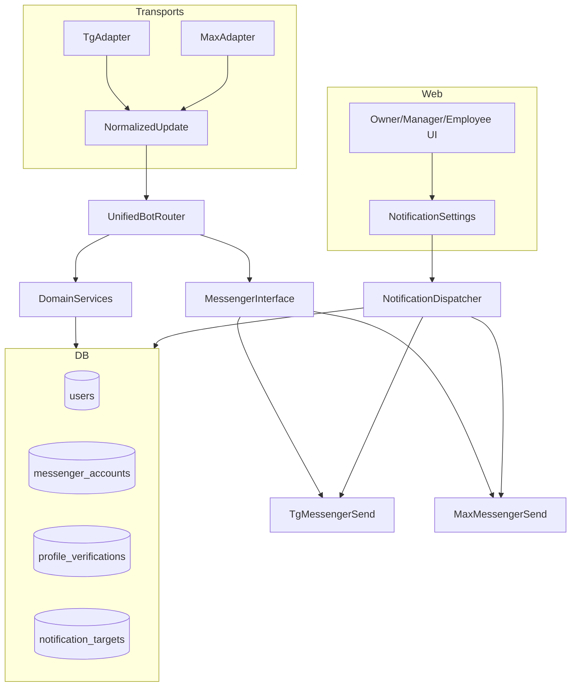

## Сводка прогресса (актуализация коду, 2026-03)

**Сверка документов:** этот файл и `.cursor/plans/staffprobot-max-bot-implementation_9140fc53.plan.md` совпадают по **YAML todos** и тексту до конца **Фазы 1**; **детальные фазы 2–5** (бот, веб, уведомления, паритет) расписаны **только** в `.cursor/plans/...`.

### Последнее обновление (2026-03-21)

- **Документ:** таблица Phase 0 переразмечена (статус 🟩/🟨 + «остаток до прода»); блок **Матрица остаток до прода** и **Чеклист деплоя**.
- **Инвентаризация legacy/TG:** `doc/plans/max-legacy-inventory.md` (пути к чатам отчётов, прямые `Bot.send_message`, команды `rg`); unit: `test_report_group_broadcast_prefs.py` в `ci_smoke`.
- **Веб / Tasks v2:** карточка смены владельца — отдельный блок «Tasks v2», ссылки **хранилище** + **Telegram** / **MAX** из `completion_media[].delivery` (`owner/shifts/detail.html`). Ранее задачи `task_v2` попадали в «manual» и не отображались.
- **MAX client:** при успешном `POST /messages` (текст и картинка) в DEBUG логируется превью тела ответа для сверки с `_max_api_public_link`.
- **Runbook:** `doc/plans/max-rollout-runbook.md` — `MAX_FEATURES_ENABLED`, перезапуск `web` при обновлении только volume без rebuild.
- **CI:** обязательный gate — `pytest -m ci_smoke` (адаптеры TG/MAX, `_max_api_public_link`, канал MAX в шаблонах); полный `tests/` — шаг с `continue-on-error` + coverage.
- **Feature flag:** `MAX_FEATURES_ENABLED` (по умолчанию `true`) — вебхук 503, без исходящего MAX (`MaxClient`, группы отчётов, `MaxNotificationSender`).

### notification_targets + Celery

Групповые поздравления (ДР/праздники) в чаты объектов идут через `send_object_report_group_text` → `resolve_object_report_group_channels` → `get_telegram_report_chat_id_for_object` / `get_max_report_chat_id_for_object` (targets + legacy). Отдельных прямых обходов `telegram_report_chat_id` в Celery для этих сценариев нет.

### Обновление (2026-03-20)

- **Хранение медиа (owner):** лейблы/тексты — «Только Telegram/MAX», акцент на мессенджеры + опционально S3 (`owner_media_storage_service`, `media_storage_settings.html`).
- **Tasks v2 / MAX:** при завершении с медиа в `completion_media` добавляется опционально **`delivery`**: `telegram` (URLs) и/или `max` — по факту успешной отправки; убрана блокировка «обязателен telegram chat» для режимов без S3, если отчёт уходит в MAX (`misc_handlers_unified`, `max_report_sender` → tuple ссылок, `MaxClient.send_photo*`).
- **Парсинг ссылок MAX:** расширен `_max_api_public_link` (вложенные `message.body`, `body.message`, доп. ключи); unit `test_max_api_public_link.py`.
- **Мелочи:** импорт `ShiftTask` в `shift_task_service`; правка импорта `TimeslotTaskTemplate` в `test_shift_tasks.py`. Полный `tests/unit` в CI по-прежнему с большим числом падений (отдельный бэклог).

| Todo / тема | Статус | Что в репозитории | Осталось |
|-------------|--------|-------------------|----------|
| **inventory-telegram-coupling** (Фаза 0) | ✅ | Таблица в документе + backlog | — |
| **db-messenger-accounts** | ✅ | Миграция `20260317_max_phase1`, `MessengerAccount`, backfill из `users.telegram_id`, `user_manager`, резолв в `user_resolver` | Довести единый резолв везде вместо прямого `telegram_id` там, где ещё осталось |
| **db-profile-verifications** | ✅ схема | Таблица в той же миграции | Бизнес-логика KYC — по плану после MAX |
| **db-notification-targets** | 🟨 | Таблица + backfill TG, `notification_target_service`, owner/bot/broadcast | Celery группы ✅ (`send_object_report_group_text`); опционально: убрать дубли с legacy-колонками объектов/орг |
| **unified-bot-router** | 🟨 | + TG: `button_callback` → router (смены/объекты/tasks v2); `/help`, `/status` через router; убраны дубли `open_object`/`close_object`/`select_object_to_open` из `bot.py`; резолв TG через `messenger_accounts` | Планирование смен, отчёты, гео в TG — пока legacy; перенос по мере готовности unified |
| **max-webhook-and-client** | ✅ | `apps/web/routes/max_webhook.py`, `MaxAdapter`, `MaxClient` (+ скачивание фото по token), `MaxMessenger` | Подтвердить форму ответа POST `/messages` на проде; при необходимости донастроить извлечение ссылки |
| **web-linking-and-settings** | 🟨 | Привязка MAX (код + ЛК), `messenger_link_service`, объекты TG/MAX + `notification_targets`; `/owner/notifications`: группы отчётов + личные TG/MAX/ЛК по типам | UX договоров/карточек сотрудника (витрина TG+MAX), вычистить остатки TG-only в копирайте |
| **notifications-max-channel** | ✅ | Зеркало TG→MAX без отдельного флага (по решению) | — |
| **tasks-v2-dual-delivery-links** | ✅ | `completion_media[].delivery`, веб: `/owner/shifts/...` блок Tasks v2 + ссылки | — |
| **media-storage-copy-telegram-max** | ✅ | Лейблы и подсказка в шаблоне настроек | — |
| **tests-and-rollout** | 🟨 | `ci_smoke` в CI (`tests/unit`), runbook, `MAX_FEATURES_ENABLED` | Greenfield: расширять `ci_smoke`; починить сломанные integration (не gate); смоук руками по runbook |

### Матрица «остаток до прода» (сводка по модулям)

Условие «готово к проду»: функционал проверен на стенде, env заданы, откат понятен (`max-rollout-runbook.md`).

| Модуль / риск | Готовность | Что сделать перед продом |
|---------------|------------|---------------------------|
| MAX webhook + client + флаг `MAX_FEATURES_ENABLED` | 🟩 | Прописать env на проде; зарегистрировать webhook; смок личного чата |
| Персональные уведомления MAX (dispatcher, шаблоны, prefs `max` в ЛК) | 🟩 | Смок: событие → запись в MAX + авто-логин ссылка |
| Группы отчётов (targets + `send_object_report_group_text` + toggles владельца) | 🟩 | Смок: объект с TG и/или MAX чатом, тестовое сообщение / ДР на стенде |
| Celery групповые сценарии | 🟩 | Уже через единый broadcast; при новых задачах — не обходить сервис |
| Web auth / JWT / `user_id` vs `telegram_id` | 🟨 | Прогон сценариев owner (смены, отмены, объекты) после каждого крупного merge |
| Unified router vs legacy TG (`shift_handlers`: планирование, отчёты, гео) | 🟨 | Не блокер для «MAX на проде»; блокер для «полного паритета сценариев в TG через router» |
| UI: договоры / сотрудники / единая витрина привязок TG+MAX | 🟨 | Ревью экранов; приоритет по продукту |
| Legacy поля `telegram_report_chat_id` на объекте/орг | 🟨 | Работает через fallback; вычищать дубли с targets — по желанию |
| CI: только `ci_smoke` gate | 🟨 | Достаточно для merge; полный `tests/unit` — бэклог |

**Фазы 2–5 (только в `.cursor/plans/...`) — кратко по факту:**

| Блок | Статус | Комментарий |
|------|--------|-------------|
| Фаза 2 — MAX-бот (смены, объекты, расписание, задачи) | 🟨 | `shared/bot_unified/*` (shift/object/schedule/misc handlers) |
| Фаза 5 — медиа Tasks v2 в MAX | 🟨→🟩 частично | Отправка в TG+MAX, JSON с `delivery`; ссылка MAX зависит от ответа API |
| Фаза 5 — геолокация в MAX | 🟨 | Unified-обработка координат в router |
| Фаза 4 — персональные уведомления в MAX | 🟨 | Диспетчер/Celery + шаблоны; создание MAX-записей в сценариях — по мере нужды |

---

## Следующие шаги (приоритет)

1. ~~**notification_targets end-to-end (Celery / группы)**~~ — ДР/праздники через `send_object_report_group_text`; точечный поиск других legacy-путей.
2. ~~**Owner: переключатели каналов (группы)**~~ — `/owner/notifications`: блок «Группы отчётов», `report_group_messengers`. ~~**Личные: Telegram / MAX / ЛК по типам**~~ — тот же экран, prefs `max` + `create_notification_telegram_and_max_if_linked`.
3. ~~**Веб: `completion_media.delivery`**~~ — карточка смены владельца, Tasks v2.
4. **MAX API на проде** — DEBUG, превью `POST /messages`; при необходимости — `_max_api_public_link`.
5. **Unified router: хвосты TG** — планирование, отчёты, гео (после стабилизации MAX на проде).
6. ~~**CI smoke gate**~~ — `pytest tests/unit -m ci_smoke`.
7. ~~**Rollout / флаг**~~ — `MAX_FEATURES_ENABLED`, `max-rollout-runbook.md`, `restart web` при volume-only обновлениях.

### Чеклист деплоя MAX на прод (кратко)

| # | Действие | Где смотреть |
|---|----------|----------------|
| 1 | `MAX_BOT_TOKEN`, `MAX_WEBHOOK_BASE_URL`, при необходимости `MAX_FEATURES_ENABLED=true` | `.env` / compose прод |
| 2 | `docker compose … up -d` (или `restart web` если только шаблоны/volume) | runbook |
| 3 | Зарегистрировать webhook | `scripts/setup_max_webhook.py` |
| 4 | Смок: `/start` в MAX, привязка в ЛК | — |
| 5 | Смок: группа отчёта (TG и/или MAX) + toggle владельца | `/owner/notifications` |
| 6 | Смок: персональное уведомление + ссылка в ЛК | — |
| 7 | Запасной откат: `MAX_FEATURES_ENABLED=false` + restart | runbook |

---

## Контекст и цель

Нужно внедрить **MAX‑бота** в StaffProBot так, чтобы:

- **логика была одна** (команды, сценарии, FSM), а различия жили в адаптерах;
- пользователь мог быть авторизован/привязан **одновременно** в Telegram и MAX (один `user_id` в БД);
- веб‑часть (авторизация, карточки сотрудников, договоры, настройки) корректно работала без жёсткой привязки к TG;
- появился новый канал оповещений **MAX** (везде, где сейчас Telegram), с настройками у собственника/организации/объекта.

Источник паттерна: `.cursor/skills/tg-max-bots/GUIDE_STAFFPROBOT_MAX_BOT.md`.

## Обязательные инварианты (важно не сломать)

- `user_id` — внутренний ID из БД, а не `telegram_id` (см. правила проекта).
- Маршрутизация по ролям не меняется (префиксы только в `apps/web/app.py`).
- Уведомления с deep‑link в веб остаются (авто‑логин токены, URLHelper и т.п.).

## Общая архитектура (целевое состояние)

- **UnifiedBotRouter**: единый обработчик команд/сценариев.
- **TgAdapter / MaxAdapter**: преобразуют вход в `NormalizedUpdate`.
- **MessengerInterface**: единый выход (send_text/send_media/answer_callback + feature flags).
- **DB** хранит *несколько* привязок мессенджеров к одному пользователю и *несколько* целевых чатов/каналов для уведомлений.

---

## Фаза 0 — Инвентаризация (завершена)

> **Phase 0 завершена.** Таблица ниже — выход Phase 0 → **бэклог Phase 1**.

### Таблица изменений по файлам/модулям (Phase 0 → прогресс и остаток до прода)

Легенда: 🟩 сделано для выкладки MAX / 🟨 частично или нужен смок / ⬜ не взято или вне текущего скоупа.

| Зона | Файл(ы) | Было (проблема MAX) | Статус | Остаток до прода |
|------|---------|----------------------|--------|-------------------|
| **Users (DB)** | `domain/entities/user.py`, миграции | TG как единственная привязка | 🟩 | Контролировать миграции на проде; legacy `telegram_id` сохраняется |
| **Web login** | `apps/web/routes/auth.py` | вход только через призму TG | 🟨 | Смок: MAX linking + вход в ЛК на прод-стенде |
| **Auto-login** | `core/auth/auto_login.py`, `notification_dispatcher.py` | привязка к `telegram_id` | 🟩 | Смок: уведомление в MAX → ссылка → ЛК |
| **JWT / middleware** | `auth_middleware.py`, `role_middleware`, роуты | путаница `id` / `telegram_id` | 🟨 | Регрессия owner/manager после деплоев |
| **Notifications** | `notification_dispatcher.py`, `senders/max_sender.py` | только TG | 🟩 | `MAX_FEATURES_ENABLED`; prefs `max` в `notification_preferences` |
| **Templates** | `shared/templates/notifications/base_templates.py` | только TG | 🟩 | При новых типах — не забывать MAX-вариант + `$link_url` |
| **Object / org чаты** | `object.py`, `org_structure.py`, `notification_target_service.py` | один TG chat id | 🟨 | Targets + fallback на legacy; смок обоих мессенджеров |
| **Owner object UI/routes** | `owner.py`, `owner/objects/*.html` | нет MAX в формах | 🟨 | Проверить сохранение TG+MAX + `upsert_object_report_target` |
| **Bot media / отчёты** | `shift_handlers.py`, `shared/bot_unified/*`, `report_group_broadcast.py` | TG-only группа | 🟨 | Резолв чата через `get_*_report_chat_id_for_object` ✅; TG гео/планирование — ещё legacy |
| **Bot integration (web)** | `apps/web/services/bot_integration.py` | TG-only обвязка | 🟨 | Здоровье/статус MAX на проде по необходимости |
| **Contracts / Employees** | `contract_service.py`, шаблоны employees | копирайт TG-only | 🟨 | Витрина привязок TG+MAX в карточках — по продукту |
| **Celery** | `birthday_tasks.py`, др. | прямой `telegram_report_chat_id` | 🟩 для групп | ДР/праздники → `send_object_report_group_text`; личные рассылки в `offer_tasks` — отдельно от MAX |

Детальный план правок Phase 1+ (колонки «что меняем») сохранён в истории: миграции `messenger_accounts` / `notification_targets`, MAX sender, resolver `user_id`.

---

## Фаза 1 — Модель данных: «один user, два мессенджера»

### 1.1. Новые сущности/поля

**Таблица `messenger_accounts`** (привязки мессенджеров и будущих OAuth):

- `id` (PK)
- `user_id` (FK → users.id)
- `provider` (enum/text): `telegram`, `max`, затем `yandex_id`, `tinkoff_id` для OAuth
- `external_user_id` (string): TG user id / MAX user_id / OAuth external id
- `chat_id` (string, optional): TG/MAX chat_id
- `username` (optional)
- `linked_at`, `last_seen_at`
- **индексы**: `UNIQUE(provider, external_user_id)`, `(user_id, provider)` unique

**Таблица `profile_verifications`** (задел под KYC, логика после MAX):

- `id` (PK)
- `profile_id` (FK → profiles.id)
- `provider` (text)
- `identity_key` (string): ИНН, СНИЛС, хэш
- `verified_at` (timestamp)
- **индексы**: `UNIQUE(provider, identity_key)`, `(profile_id, provider)` unique

### 1.2. Обратная совместимость

- Оставить `users.telegram_id` как legacy‑кэш.
- Сервис `get_user_id_from_provider(provider, external_user_id)` для резолвинга.

### 1.3. notification_targets

- scope_type, scope_id, messenger, target_type, target_chat_id, is_enabled
- Миграция TG полей в эти записи.

---

## Фазы 2–5 (кратко)

**Фаза 2**: NormalizedUpdate, Messenger‑интерфейс, TgAdapter, MaxAdapter, MaxClient, единый Router.
**Фаза 3**: привязка TG/MAX, карточка сотрудника, договоры, настройки owner/org/object.
**Фаза 4**: MAX канал в NotificationDispatcher, deep-links.
**Фаза 5**: медиа, геолокация, клавиатуры.

## Post-MAX: OAuth и KYC

- Auth‑дубли: UNIQUE(provider, external_user_id) в messenger_accounts.
- KYC‑дубли: UNIQUE(provider, identity_key) в profile_verifications.
- Реализация OAuth и KYC — после rollout MAX.

## Миграции

- messenger_accounts, notification_targets, profile_verifications
- backfill из users.telegram_id и chat_id полей
- legacy поля заморозить

## Риски

- Дубли пользователей/профилей — схема заложена в Phase 1.
- Права доступа, импорт/экспорт, секреты, rate limiting.
