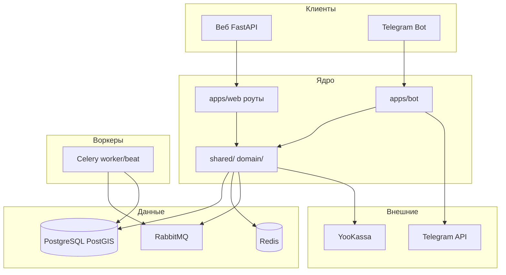

# StaffProBot — Портфолио: инженерные решения (RU)

## SYSTEM OVERVIEW (обзор системы)

StaffProBot — платформа управления сменами и персоналом с Telegram-ботом и веб-приложением на FastAPI. Владельцы и управляющие создают объекты (точки), тайм-слоты и смены; сотрудники работают по сменам и получают расчёт зарплаты по ставкам договора/слота/объекта. Договоры строятся на шаблонах и версиях; конструктор документов в разработке. Реализованы геолокация (PostGIS) для зон объектов и контроля выхода на смену, календарь с drag-and-drop, расчёт зарплаты с корректировками и биллинг (YooKassa), отзывы и рейтинги с модерацией, уведомления (Telegram и веб) со ссылками одноразового входа на нужную страницу. Несколько ролей у пользователя (владелец, управляющий, сотрудник, соискатель, суперадмин) обеспечиваются префиксами роутов и middleware. Деплой — Docker Compose, CI/CD через GitHub Actions на прод.

---

## Инженерные решения

### 1. Роутинг по ролям и доступ веб + бот

**Проблема:** Один продукт должен обслуживать владельцев, управляющих, сотрудников и соискателей с разными интерфейсами и правами; у пользователя может быть несколько ролей; вход — через Telegram или веб.

**Решение:** Префиксы ролей задаются один раз в `apps/web/app.py` (include_router для /owner, /manager, /employee, /admin, /moderator). В файлах роутов префиксы не дублируются. Единый `user_id` из БД (не telegram_id) для всей серверной логики; `get_user_id_from_current_user()` получает его из JWT или сессии. Бот выдаёт PIN для входа в веб и связывает аккаунты.

**Бизнес-ценность:** Чёткое разделение интерфейсов и прав; один аккаунт может быть и владельцем, и сотрудником; бот и веб синхронны.

**Стек:** FastAPI, JWT (python-jose, PyJWT), passlib/bcrypt, python-telegram-bot.

**Ключевые компоненты:** `apps/web/app.py`, `shared/services/user_service.py` (get_user_id_from_current_user), middleware авторизации, обработчики бота для PIN.

---

### 1.1. Единый паттерн бота для Telegram + MAX

**Проблема:** Нужно добавить MAX-бота без дублирования логики Telegram-бота и без расхождения поведения между каналами.

**Решение:** Выделить транспортный интерфейс и нормализованный DTO апдейта, а затем пропускать webhook-и Telegram и MAX через единый обработчик. Различия мессенджеров держать в адаптерах и фиче-флагах (например, в MAX нет WebApp и request_contact). Зафиксировать единый маппинг идентификаторов мессенджера, чтобы не расходиться с БД/настройками.

**Бизнес-ценность:** Быстрее запуск в новых мессенджерах и дешевле сопровождение; меньше рисков регрессий из-за «двух разных ботов».

**Стек:** python-telegram-bot, MAX `platform-api.max.ru`, паттерн DTO/adapter.

---

### 2. PostGIS и геоконтроль

**Проблема:** Нужно ограничить открытие смены фактическим местоположением и показывать объекты «доступные для соискателей» по географии.

**Решение:** PostgreSQL с PostGIS; координаты и радиус объекта; проверка при открытии смены; карта (например Яндекс.Карты) объектов; геофильтры и геоотчёты; индексы и кэширование геозапросов.

**Бизнес-ценность:** Исключение «фейкового» выхода на смену; соискатели видят только подходящие по месту объекты; аналитика покрытия.

**Стек:** PostgreSQL 15, PostGIS, SQLAlchemy, asyncpg, shapely/geopy.

**Ключевые компоненты:** Модель объекта (координаты, радиус), валидация открытия смены, карта, геозапросы.

---

### 3. Календарь и тайм-слоты

**Проблема:** Планирование смен по дням/неделям с явными слотами и ограничением по числу сотрудников на слот.

**Решение:** Модель TimeSlot (день, время, max_employees); смена назначает сотрудника на слот; FullCalendar.js с drag-and-drop; общие компоненты календаря (templates/shared/calendar/, static/js/shared/calendar*.js); валидация от переполнения; рефакторинг (итерация 17) для общего кода владелец/управляющий/сотрудник.

**Бизнес-ценность:** Наглядное планирование, меньше двойных назначений, единый UX для всех ролей.

**Стек:** FullCalendar.js, Bootstrap 5, HTMX, vanilla JS, Jinja2.

**Ключевые компоненты:** TimeSlot, Shift, шаблоны и JS календаря, API календаря.

---

### 4. Договоры, шаблоны и PDF

**Проблема:** Унифицированные договоры с версиями и редактируемыми шаблонами; генерация подписанного PDF.

**Решение:** Модель Contract (пользователь, объект); шаблоны и версии; конструктор (мастер) в разработке (итерация 54); PDF через WeasyPrint/ReportLab; история договоров (итерация 260115).

**Бизнес-ценность:** Единообразие документов, аудит, меньше ручного составления.

**Стек:** WeasyPrint, ReportLab, Jinja2 (шаблоны), PostgreSQL.

**Ключевые компоненты:** Contract, ContractTemplate, версии шаблонов, генерация PDF, история договоров.

---

### 5. Расчёт зарплаты и биллинг

**Проблема:** Корректный расчёт по сменам при нескольких источниках ставок; корректировки и графики выплат; биллинг и тарифы.

**Решение:** PayrollEntry по сменам; приоритет ставок: договор → тайм-слот → объект; Adjustments для премий/штрафов; графики выплат (ежедневно/еженедельно/ежемесячно); Celery для расчётных задач; биллинг, тарифы, лимиты (админ); YooKassa для платежей.

**Бизнес-ценность:** Прозрачный расчёт, меньше споров, контроль лимитов и подписок.

**Стек:** Celery, RabbitMQ, Redis, API YooKassa, pandas/openpyxl для отчётов.

**Ключевые компоненты:** PayrollEntry, Adjustments, настройки графиков выплат, модели биллинга/тарифов, задачи Celery, интеграция YooKassa.

---

### 6. Уведомления со ссылками авто-логина

**Проблема:** Каждое Telegram-сообщение о действии должно вести на нужную страницу веба без повторного ввода логина.

**Решение:** В шаблонах `shared/templates/notifications/base_templates.py` для Telegram предусмотрен плейсхолдер `$link_url`; `NotificationDispatcher._inject_auto_login_url()` формирует одноразовый URL входа; маппинг тип уведомления → путь в `NotificationActionService.get_action_url()`. Прямые отправки из бота используют `build_auto_login_url()` из `core/auth/auto_login.py`.

**Бизнес-ценность:** Один переход из Telegram в нужный раздел веб-приложения; выше вовлечённость и меньше обращений в поддержку.

**Стек:** python-telegram-bot, JWT/кратковременный токен, URLHelper для базового URL.

**Ключевые компоненты:** base_templates.py, NotificationDispatcher, NotificationActionService, модуль auto_login.

---

### 7. Отзывы и рейтинги с модерацией

**Проблема:** Сигналы доверия и качества по сотрудникам и объектам; нужны модерация и обжалование.

**Решение:** Таблица отзывов (автор, target_type employee/object, contract_id, рейтинг, текст, статус); review_media; review_appeals с решением модератора; агрегат рейтингов; роль модератора и интерфейс /moderator/*; общие компоненты и API отзывов.

**Бизнес-ценность:** Доверие, разрешение споров, отчёты для владельцев и админов.

**Стек:** PostgreSQL (JSONB для метаданных), MinIO/S3 или Telegram для медиа, общие сервисы.

**Ключевые компоненты:** reviews, review_appeals, ratings, review_service, роуты и шаблоны модератора.

---

### 8. Docker и CI/CD

**Проблема:** Воспроизводимые dev и prod; автоматические тесты и деплой.

**Решение:** docker-compose.dev.yml (postgres с PostGIS, redis, rabbitmq, minio, web, bot, celery_worker, celery_beat); docker-compose.prod.yml для прода; health checks; GitHub Actions: тесты (pytest, PostgreSQL/Redis), линт (black, flake8, mypy), безопасность (safety, bandit), деплой при push в main (SSH, git pull, compose up, проверка health, таблица deployments).

**Бизнес-ценность:** Одинаковое окружение везде; меньше «у меня работает»; фиксируемые деплои.

**Стек:** Docker, Docker Compose, GitHub Actions, pytest, Codecov.

**Ключевые компоненты:** docker-compose.dev.yml, docker-compose.prod.yml, .github/workflows, README по деплою, таблица deployments.

---

## Упрощённая архитектура (mermaid)

---

## Changelog (короткие записи для портфолио)

- **Мультиролевая платформа:** владелец, управляющий, сотрудник, соискатель, суперадмин; префиксы роутов в app.py; user_id из БД; PIN из бота для веб-входа.
- **Геолокация PostGIS:** зоны объектов, проверка при выходе на смену, карта, геофильтры и отчёты.
- **Календарь и тайм-слоты:** FullCalendar drag-and-drop, общие компоненты, max_employees на слот, рефакторинг для всех ролей.
- **Договоры и шаблоны:** шаблоны, версии, PDF (WeasyPrint); конструктор и история в разработке.
- **Расчёт и биллинг:** PayrollEntry, приоритет ставок, корректировки, графики выплат, Celery, YooKassa.
- **Уведомления с авто-логином:** Telegram и веб; $link_url в шаблонах; NotificationActionService; ссылки в один клик.
- **Отзывы и рейтинги:** отзывы, модерация, обжалования, интерфейс модератора.
- **Docker и CI/CD:** dev/prod Compose, health checks, GitHub Actions тесты/линт/деплой, таблица deployments.

---

## Текст для страницы проекта на портфолио

StaffProBot — платформа управления сменами и персоналом с Telegram-ботом и веб-приложением на FastAPI. Реализованы несколько ролей (владелец, управляющий, сотрудник, соискатель), геоконтроль выхода на смену (PostGIS), календарь с drag-and-drop и тайм-слотами, шаблоны договоров и генерация PDF, расчёт зарплаты с приоритетом ставок и корректировками, уведомления со ссылками одноразового входа из Telegram в веб. Стек: PostgreSQL (PostGIS), Redis, RabbitMQ, Celery, YooKassa, CI/CD на Docker. В дорожной карте — четыре модуля: биржа смен, умное планирование, автоматические выплаты, кадровое ЭДО.
