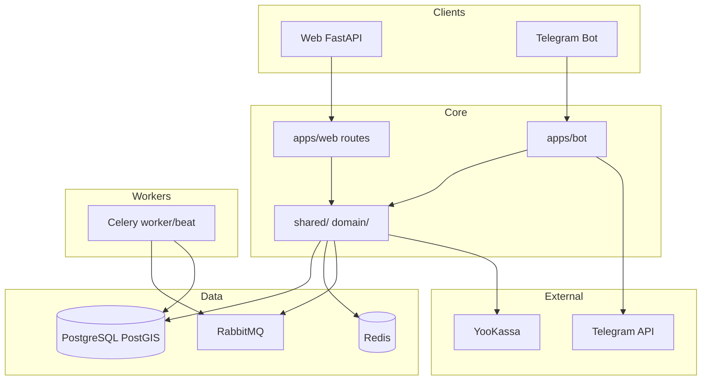

# StaffProBot — Portfolio Engineering (EN)

## SYSTEM OVERVIEW

StaffProBot is a shift-and-staff management platform with a Telegram bot and a FastAPI web app. Owners and managers create objects (locations), time slots and shifts; employees work shifts and receive pay calculated from contract/slot/object rates. Contracts use templates and versions; a document constructor is in progress. The system supports geolocation (PostGIS) for object zones and shift check-in, a drag-and-drop calendar, payroll with adjustments and billing (YooKassa), reviews and ratings with moderation, and notifications (Telegram + web) with one-click login links to the relevant web page. Multiple roles per user (owner, manager, employee, applicant, superadmin) are enforced via route prefixes and middleware. Deployment is Docker Compose with GitHub Actions CI/CD to production.

---

## Engineering decisions

### 1. Multi-role routing and web + bot access

**Problem:** One product must serve owners, managers, employees and applicants with different UIs and permissions; users may have several roles; access can be via Telegram or web.

**Engineering Solution:** Role prefixes defined once in `apps/web/app.py` (`include_router` for /owner, /manager, /employee, /admin, /moderator). No duplicate prefixes in route files. Single `user_id` from DB (not telegram_id) for all server logic; `get_user_id_from_current_user()` resolves from JWT or session. Telegram bot issues a PIN for web login and links accounts.

**Business Value:** Clear separation of interfaces and permissions; one account can act as owner and employee; bot and web stay in sync.

**Tech Stack:** FastAPI, JWT (python-jose/PyJWT), passlib/bcrypt, python-telegram-bot.

**Key Components:** `apps/web/app.py`, `shared/services/user_service.py` (get_user_id_from_current_user), auth middleware, bot handlers for PIN.

---

### 1.1. Unified multi-messenger bot pattern (Telegram + MAX)

**Problem:** Need to add a MAX bot without duplicating Telegram bot logic, keeping identical behavior across messengers.

**Engineering Solution:** Introduce a transport interface + a normalized update DTO, then route both Telegram and MAX webhooks through a single handler. Messenger-specific differences stay inside adapters and feature flags (e.g. no WebApp / contact request in MAX). Keep a stable mapping of messenger identifiers to avoid DB/config drift.

**Business Value:** Faster rollout to new messengers and lower maintenance cost; reduced risk of behavior divergence.

**Tech Stack:** python-telegram-bot, MAX `platform-api.max.ru`, DTO/adapter pattern.

---

### 2. PostGIS and geolocation control

**Problem:** Need to restrict shift opening to actual location and show objects “available for applicants” by geography.

**Engineering Solution:** PostgreSQL with PostGIS; object coordinates and radius; validation at shift open; map (e.g. Yandex Maps) for objects; geo-filters and geo-reports; indexes and caching for geo queries.

**Business Value:** Prevents fake check-in; applicants see only nearby/eligible objects; better coverage analytics.

**Tech Stack:** PostgreSQL 15, PostGIS, SQLAlchemy, asyncpg, shapely/geopy.

**Key Components:** Object model (coordinates, radius), shift open validation, map views, geo queries.

---

### 3. Calendar and time slots

**Problem:** Planning shifts by day/week with clear slots and capacity (max employees per slot).

**Engineering Solution:** TimeSlot model (day, time, max_employees); Shift assigns employee to slot; FullCalendar.js with drag-and-drop; shared calendar components (templates/shared/calendar/, static/js/shared/calendar*.js); validation to prevent overbooking; refactor (iteration 17) for shared code across owner/manager/employee.

**Business Value:** Visual planning, fewer double-bookings, same UX for all roles.

**Tech Stack:** FullCalendar.js, Bootstrap 5, HTMX, vanilla JS, Jinja2.

**Key Components:** TimeSlot, Shift, calendar templates and JS, routes for calendar API.

---

### 4. Contracts, templates and PDF

**Problem:** Standardised contracts with versions and editable templates; generate signed PDFs.

**Engineering Solution:** Contract model linked to user and object; template/version model; constructor (master) for templates in progress (iteration 54); PDF via WeasyPrint/ReportLab; contract history (iteration 260115).

**Business Value:** Consistent documents, audit trail, less manual drafting.

**Tech Stack:** WeasyPrint, ReportLab, Jinja2 (templates), PostgreSQL.

**Key Components:** Contract, ContractTemplate, template versions, PDF generation, contract history.

---

### 5. Payroll and billing

**Problem:** Correct pay from shifts with multiple rate sources; support adjustments and payout schedules; optional billing/tariffs.

**Engineering Solution:** PayrollEntry from shifts; rate priority: contract → time slot → object; Adjustments for bonuses/penalties; payout schedules (daily/weekly/monthly); Celery for calculation jobs; billing, tariffs, limits (admin); YooKassa for payments.

**Business Value:** Transparent calculation, fewer disputes, controlled limits and subscriptions.

**Tech Stack:** Celery, RabbitMQ, Redis, YooKassa API, pandas/openpyxl for reports.

**Key Components:** PayrollEntry, Adjustments, payout schedule config, billing/tariff models, Celery tasks, YooKassa integration.

---

### 6. Notifications with auto-login links

**Problem:** Every action-related Telegram message should deep-link to the right web page without asking the user to log in again.

**Engineering Solution:** Templates in `shared/templates/notifications/base_templates.py` include `$link_url` for Telegram; `NotificationDispatcher._inject_auto_login_url()` builds a one-time login URL; mapping notification type → path in `NotificationActionService.get_action_url()`. Direct bot messages use `build_auto_login_url()` from `core/auth/auto_login.py`.

**Business Value:** One tap from Telegram to the relevant page in the web app; better engagement and fewer support questions.

**Tech Stack:** python-telegram-bot, JWT/short-lived token, URLHelper for base URL.

**Key Components:** base_templates.py, NotificationDispatcher, NotificationActionService, auto_login module.

---

### 7. Reviews and ratings with moderation

**Problem:** Trust and quality signals for employees and objects; need moderation and appeal flow.

**Engineering Solution:** Reviews table (reviewer, target_type employee/object, contract_id, rating, content, status); review_media; review_appeals with moderator decision; ratings aggregate table; moderator role and /moderator/* interface; shared review components and API.

**Business Value:** Credibility, dispute resolution, reporting for owners and admins.

**Tech Stack:** PostgreSQL (JSONB for metadata), MinIO/S3 or Telegram for media, shared services.

**Key Components:** reviews, review_appeals, ratings, review_service, moderator routes and templates.

---

### 8. Docker and CI/CD

**Problem:** Reproducible dev and prod; automated tests and deploy.

**Engineering Solution:** docker-compose.dev.yml (postgres with PostGIS, redis, rabbitmq, minio, web, bot, celery_worker, celery_beat); docker-compose.prod.yml for production; health checks; GitHub Actions: test (pytest, PostgreSQL/Redis services), lint (black, flake8, mypy), security (safety, bandit), deploy on push to main (SSH, git pull, compose up, health check, deployments table).

**Business Value:** Same environment everywhere; fewer “works on my machine” issues; traceable deploys.

**Tech Stack:** Docker, Docker Compose, GitHub Actions, pytest, Codecov.

**Key Components:** docker-compose.dev.yml, docker-compose.prod.yml, .github/workflows, deployment README, deployments table.

---

## Simplified architecture (mermaid)

---

## Changelog (short entries for portfolio)

- **Multi-role platform:** Owner, manager, employee, applicant, superadmin; route prefixes in app.py; user_id from DB; PIN from bot for web.
- **PostGIS geolocation:** Object zones, shift check-in validation, map, geo-filters and reports.
- **Calendar and time slots:** FullCalendar drag-and-drop, shared components, max_employees per slot, refactor for all roles.
- **Contracts and templates:** Templates, versions, PDF (WeasyPrint); constructor and history in progress.
- **Payroll and billing:** PayrollEntry, rate priority, adjustments, payout schedules, Celery, YooKassa.
- **Notifications with auto-login:** Telegram and web; $link_url in templates; NotificationActionService; one-click links.
- **Reviews and ratings:** Reviews, moderation, appeals, moderator interface.
- **Docker and CI/CD:** dev/prod Compose, health checks, GitHub Actions test/lint/deploy, deployments table.

---

## Text for portfolio project page

StaffProBot is a shift and staff management platform with a Telegram bot and a FastAPI web app. It supports multiple roles (owner, manager, employee, applicant), geolocation-based shift check-in (PostGIS), a drag-and-drop calendar with time slots, contract templates and PDF generation, payroll with rate priority and adjustments, and notifications with one-click login links from Telegram to the web app. The stack includes PostgreSQL (PostGIS), Redis, RabbitMQ, Celery, YooKassa, and Docker-based CI/CD. The product roadmap targets four modules: shift marketplace, smart planning, automatic pay, and document automation (EDO).
